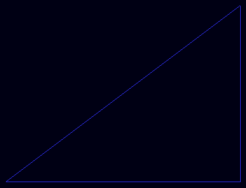

# LineDraw

LineDraw produces a 2D image with line segments drawn on it.

It is a command line tool I developed to practice working with graphics in C++.


## Input

Any line segment in the plane can be specified by its endpoints `(a, b)` and `(c, d)`.

LineDraw expects to receive text from standard input.

The text should contain one 4-tuple `(a, b, c, d)` for each line segment you want drawn, on a new line.

## Output

LineDraw will print the contents of a Portable PixMap image to standard ouput.

The image will contain the specified line segments. 

## Installation

Build from source using GCC by cloning this repo and running `build.sh`.

Then make LineDraw executable.

```
cd bin
chmod u+x LineDraw
```

## Usage

Suppose you have `mytriangle.txt` like this:

```
(0,   0, 400,   0)
(400, 0, 400, 300)
(0,   0, 400, 300)
```

To take input then capture the output of LineDraw in a PPM file you can do:

```
cat mytriangle.txt | LineDraw > mytriangle.ppm
```

and then the image can be viewed with any program that can display ppm files e.g. `feh`.



Alternatively, the PPM file can easily be converted to your preferred format with a tool like ImageMagick.

### Examples


